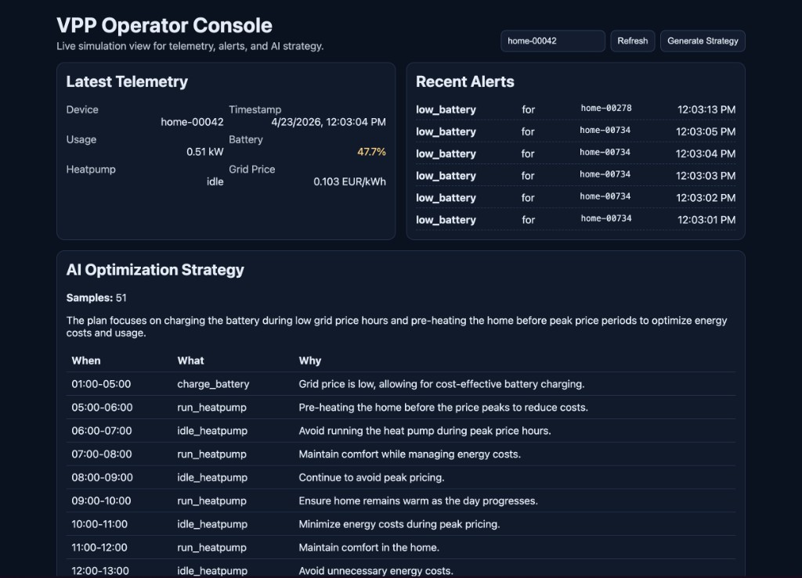

# VPP-Core: a sandbox for learning Virtual Power Plants

VPP-Core is a small, runnable Virtual Power Plant (VPP) simulation. It exists to
**experiment, learn and understand the VPP concept** end to end: what a fleet of
distributed energy assets looks like as data, how that data flows through a
streaming pipeline, and how an optimizer turns it into a plan.

It is not a production system. Everything runs on a laptop with Docker in a
couple of minutes, and every piece is small enough to read in one sitting.

## What is a VPP, and how this repo maps to it

A Virtual Power Plant aggregates many small, distributed energy resources
(home batteries, heat pumps, EV chargers, solar inverters) and operates them as
if they were one controllable plant. The core loop is:

| VPP concept | What it means | Where it lives here |
|---|---|---|
| **Assets** | Devices that consume, store or produce energy | `producer/` simulates N smart homes with a battery and a heat pump |
| **Telemetry** | Assets report state continuously (load, state of charge, mode, price) | JSON events on Kafka topic `telemetry.raw` |
| **Ingestion & enrichment** | High-volume stream processing, flagging conditions of interest | `benthos/benthos.yaml` (Bloblang mapping, fan-out to Postgres + webhook) |
| **State store** | Queryable view of the fleet | Postgres tables `telemetry_events`, `alerts` |
| **Alerting / automation** | React to events (low battery, price spike) | Benthos writes alerts, calls an n8n workflow |
| **Optimization** | Decide what each asset should do next, given history and prices | `optimizer/` Python gRPC service, LLM-backed |
| **Orchestration API** | Expose fleet state and plans to operators and other systems | `orchestrator/` Go REST API |
| **Operator console** | Humans watch the fleet | `ui/` React app |

What is deliberately missing, and therefore a good learning exercise to add:
a **control path** back to the devices (commands, dispatch, curtailment),
**fleet-level aggregation**, and **real market signals**. See the roadmap below.

## Architecture

```
producer (Go)  -->  Redpanda/Kafka (telemetry.raw)  -->  Benthos  -->  Postgres (telemetry_events, alerts)
                                                                  \->  n8n webhook (low-battery workflow)

orchestrator (Go REST :8080)  -->  optimizer (Python gRPC :50051 + OpenAI)
ui (React :3000)              -->  orchestrator
```

Telemetry event schema (one per device per tick):

```json
{
  "device_id": "home-00042",
  "ts": "2026-09-23T07:09:22Z",
  "kw_usage": 2.78,
  "battery_soc_pct": 29.89,
  "heatpump_status": "heating",
  "grid_price_eur_kwh": 0.245
}
```

Benthos adds `ingested_at` and `low_battery` (true when `battery_soc_pct < 20`).

## Services

- `redpanda`: Kafka-compatible broker
- `redpanda-init`: creates the `telemetry.raw` topic
- `postgres`: app data (`vpp`) + n8n DB (`n8n`)
- `n8n`: low-code workflow endpoint for low-battery events
- `producer`: simulated smart-home telemetry generator (Prometheus metrics on `:9101`)
- `benthos`: stream transform/routing pipeline (metrics on `:4195`)
- `optimizer`: Python gRPC service that generates optimization plans via an LLM
- `orchestrator`: REST API (`/healthz`, `/devices/{id}/latest`, `/devices/{id}/strategy`, `/alerts`)
- `ui`: React operator console (`http://localhost:3000`)

## Prerequisites

- Docker (the only hard requirement)
- OpenAI API key (optional; only the `/strategy` endpoint needs it)
- Go 1.23+, Python 3.12+, Node 20+ (only for local builds outside Docker)

## Quick Start

```bash
cp .env.example .env
# optional: set OPENAI_API_KEY in .env
# recommended on a laptop: PRODUCER_DEVICES=100

make up
make demo
```

Then open:

- UI: `http://localhost:3000`
- API: `http://localhost:8080/devices/home-00042/latest`
- n8n: `http://localhost:5678` (admin / admin)

Stop everything and drop volumes:

```bash
make down
```

### Port conflicts

The stack publishes `9092`, `9644`, `5432`, `5678`, `8080`, `8081`, `50051`,
`3000`, `9101`, `4195` on the host. If any are taken, copy
`docker-compose.override.yml.example` to `docker-compose.override.yml` and
adjust the host side of the mappings. Container-to-container networking is
unaffected.

### One-time n8n workflow import

The low-battery webhook returns 404 until the workflow is imported and
activated. Alerts are still persisted to Postgres by Benthos, so `/alerts`
works regardless.

1. open `http://localhost:5678`
2. import `n8n/workflows/low-battery.json`
3. activate it with the toggle in the top right

## UI Preview



## Learning path

Suggested order if the goal is to understand the system rather than just run it:

1. **Read the producer** (`producer/main.go`). See how a device is modelled as
   state that drifts over time, and how it is serialized onto Kafka.
2. **Watch the topic.** `docker exec vpp-redpanda rpk topic consume telemetry.raw -n 5`
3. **Read the Benthos config** (`benthos/benthos.yaml`). This is the whole
   ingestion layer: one mapping, one fan-out, one conditional branch.
4. **Query Postgres.**
   `docker exec vpp-postgres psql -U vpp -d vpp -c "select device_id, battery_soc_pct, low_battery from telemetry_events order by ts desc limit 10"`
5. **Read the orchestrator API** (`orchestrator/internal/api/router.go`) and the
   gRPC contract (`proto/optimizer.proto`). Note that the optimizer receives up
   to 7 days of history and returns a plan of timed actions.
6. **Read the optimizer** (`optimizer/server.py`). See how telemetry history is
   turned into a prompt and how the response is parsed.
7. **Break something.** Stop Postgres, watch Benthos retry. Stop the optimizer,
   watch the orchestrator return 502. Set `PRODUCER_DEVICES=5000`, watch
   batching kick in.

## Experiments to try

Ordered roughly from small to large.

- **Change the alert rule.** Edit the Bloblang in `benthos/benthos.yaml`. Add a
  price-spike alert (`grid_price_eur_kwh > 0.40`) or a "heat pump stuck heating
  for N ticks" rule.
- **Scale the fleet.** Set `PRODUCER_DEVICES=10000`. Watch Postgres insert rate,
  Benthos batching, and where latency appears first.
- **Swap the LLM.** `optimizer/server.py` uses LangChain's `ChatOpenAI`. Swap in
  Anthropic, or a local Ollama model, so the demo runs with no API key.
- **Add a rule-based optimizer.** Implement a deterministic strategy (charge when
  price is below median, discharge above) next to the LLM one. Compare outputs.
- **Add a fleet endpoint.** `/fleet/summary` returning total kW, average state of
  charge, alert rate. A VPP is operated at fleet level, not per home.
- **Use real prices.** Replace the random `grid_price_eur_kwh` with day-ahead
  prices from ENTSO-E or aWATTar. The strategy becomes meaningful.
- **Close the loop.** Add a `telemetry.commands` topic. The orchestrator publishes
  actions from the plan; the producer consumes them and changes device state.
  This is the step that turns a monitoring system into a VPP.
- **Wire n8n further.** Extend `low-battery.json` to post to Slack, open a
  ticket, or call back into the orchestrator.
- **Add a Grafana dashboard.** Producer and Benthos already expose Prometheus
  metrics. Add Prometheus + Grafana to `docker-compose.yml`.
- **Feed it real data.** Anything that publishes JSON matching the schema above
  to `telemetry.raw` works. Replace the producer with a real gateway.

## Improvement roadmap

Things known to be rough, roughly prioritized. Good first contributions.

### Fix now
- **Auto-import the n8n workflow** with an init container so the webhook works
  on first boot and Benthos stops logging 404s.
- **Benthos DSN is hardcoded** to `vpp:vpp`. Read `POSTGRES_*` from the
  environment like everything else does.
- **Offline strategy fallback.** Without an OpenAI key `/strategy` returns 502.
  A rule-based fallback plan makes the demo self-contained.
- **Lower the default fleet size** to 100 devices and document how to scale up.

### Robustness
- **Tests.** There are none. Go handler and simulation tests, Python
  optimizer prompt/parse tests, `benthos test` for the Bloblang.
- **CI.** Build, vet, type-check, `docker compose config`, and ideally a full
  stack smoke run of `make demo`.
- **Schema validation** on the Kafka topic (JSON Schema in Benthos, or protobuf
  on the wire).
- **Idempotent inserts.** At-least-once delivery plus `sql_insert` means
  duplicate rows on restart. Add an event id and `ON CONFLICT DO NOTHING`.
- **Retention.** `telemetry_events` grows unbounded. Partition by time or use a
  TimescaleDB hypertable and drop old chunks.
- **Health checks** for producer, benthos, orchestrator and ui. Only half the
  services have one.

### Features that make it a VPP rather than a telemetry pipeline
- **Control path** back to devices (commands topic, dispatch, curtailment).
- **Fleet aggregation** endpoints and UI views.
- **Real market signals** (day-ahead prices, grid frequency, imbalance prices).
- **Structured LLM output** enforced with a JSON schema instead of free text.
- **Provider-agnostic optimizer** (OpenAI, Anthropic, local models).
- **More alert types**: price spike, stuck heat pump, comms loss.

### Observability
- Prometheus + Grafana in compose with a starter dashboard.
- Consistent structured logging across services.

### Security, before this ever leaves a laptop
- No authentication on the orchestrator or UI.
- `N8N_ENCRYPTION_KEY` and database credentials are committed in compose.
- Broker, database and gRPC ports are published to the host by default.

## Useful Make Targets

- `make up` - build and start all services
- `make down` - stop and remove containers/volumes
- `make logs` - tail logs
- `make ps` - list services
- `make proto` - regenerate Go/Python gRPC stubs
- `make build` - local Go build sanity check
- `make demo` - run end-to-end API smoke flow

## Repo layout

```
producer/       Go telemetry simulator
benthos/        stream pipeline config
db/init.sql     Postgres schema
orchestrator/   Go REST API + gRPC client
optimizer/      Python gRPC optimizer (LLM)
proto/          gRPC contract
ui/             React operator console
n8n/workflows/  low-battery workflow export
scripts/demo.sh end-to-end smoke test
```
